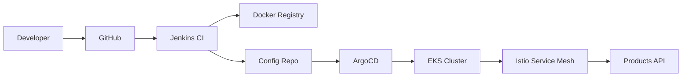

# GitOps End-to-End Example: Products API

This example demonstrates a complete GitOps workflow using a .NET Products API, from source code to production deployment.

## 🎯 Overview

This example shows how to implement a complete GitOps pipeline for a .NET REST API with the following components:

- **Application**: .NET 8 Products API with Entity Framework
- **Containerization**: Docker with multi-stage builds
- **Infrastructure**: EKS cluster provisioned with Terraform
- **CI/CD**: Jenkins pipeline with GitHub integration
- **Package Management**: Helm charts for Kubernetes deployment
- **GitOps**: ArgoCD for automated deployment
- **Service Mesh**: Istio for traffic management and security
- **Monitoring**: Observability with Prometheus and Grafana

## 📁 Directory Structure

```
example/
├── README.md
├── integration.md              # Component integration guide
├── workshop.md                 # Step-by-step implementation guide
├── source-code/               # Products API source code
│   ├── ProductsAPI/
│   ├── Dockerfile
│   ├── docker-compose.yml
│   └── .github/workflows/
├── infrastructure/            # Terraform infrastructure
│   ├── environments/
│   ├── modules/
│   └── scripts/
├── helm-charts/              # Helm charts
│   ├── products-api/
│   └── environments/
├── k8s-manifests/           # Kubernetes manifests
│   ├── base/
│   └── overlays/
├── jenkins/                 # Jenkins pipeline
│   ├── Jenkinsfile
│   └── scripts/
├── argocd/                 # ArgoCD applications
│   ├── applications/
│   └── projects/
├── istio/                  # Istio configurations
│   ├── gateways/
│   ├── virtual-services/
│   └── destination-rules/
└── monitoring/             # Monitoring setup
    ├── prometheus/
    ├── grafana/
    └── dashboards/
```

## 🚀 Quick Start

1. **Prerequisites Setup**
   ```bash
   # Clone the repository
   git clone https://github.com/company/software-engineer.git
   cd software-engineer/gitops/example
   
   # Follow the workshop guide
   cat workshop.md
   ```

2. **Infrastructure Deployment**
   ```bash
   # Deploy infrastructure
   cd infrastructure/environments/dev
   terraform init
   terraform apply
   ```

3. **Application Deployment**
   ```bash
   # Deploy application via GitOps
   kubectl apply -f argocd/applications/products-api-dev.yaml
   ```

## 🔄 GitOps Workflow



## 📚 Learning Path

1. **Start Here**: [integration.md](integration.md) - Understand component relationships
2. **Hands-On**: [workshop.md](workshop.md) - Follow step-by-step implementation
3. **Deep Dive**: Explore individual component configurations
4. **Customize**: Adapt the example for your own use case

## 🎯 What You'll Learn

- Complete GitOps workflow implementation
- .NET API containerization and deployment
- Infrastructure as Code with Terraform
- Kubernetes orchestration with Helm
- Service mesh configuration with Istio
- CI/CD pipeline automation with Jenkins
- Monitoring and observability setup

## 🔗 Related Documentation

- [Main GitOps Guide](../README.md)
- [Jenkins Configuration](../jenkins/README.md)
- [EKS Setup](../eks/README.md)
- [Helm Charts](../helm/README.md)
- [ArgoCD Configuration](../argocd/README.md)
- [Istio Service Mesh](../istio/README.md)

---

**Ready to get started?** Begin with [integration.md](integration.md) to understand how all components work together, then follow [workshop.md](workshop.md) for hands-on implementation.